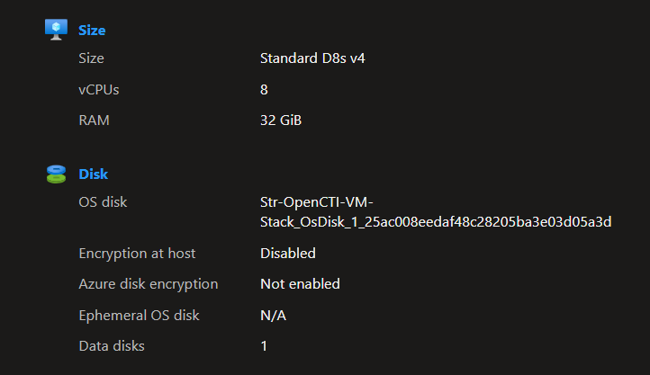
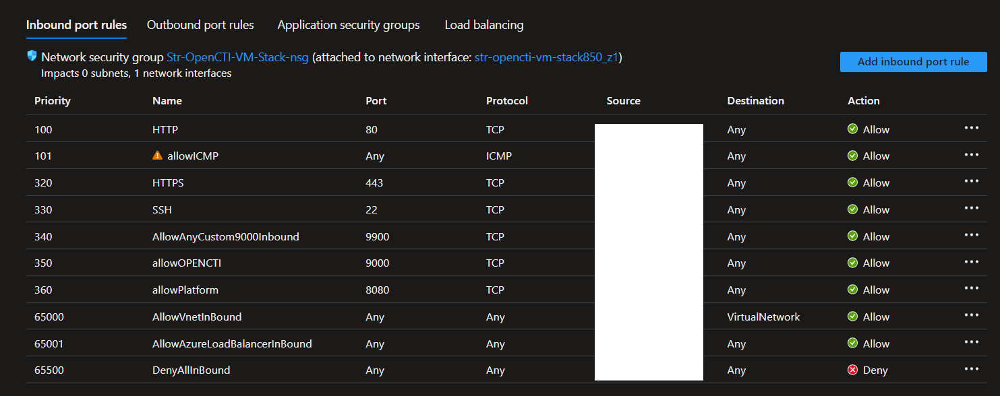
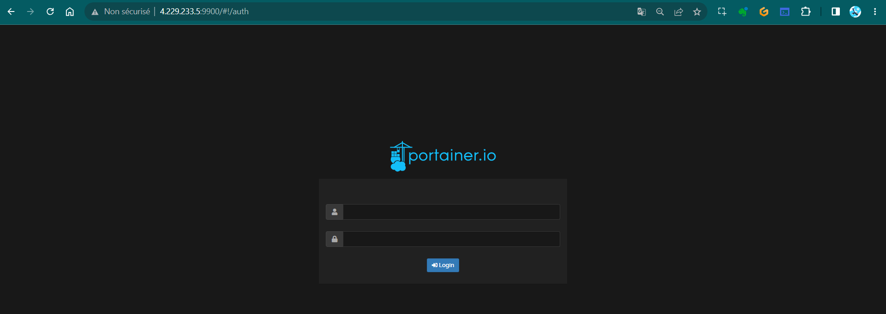
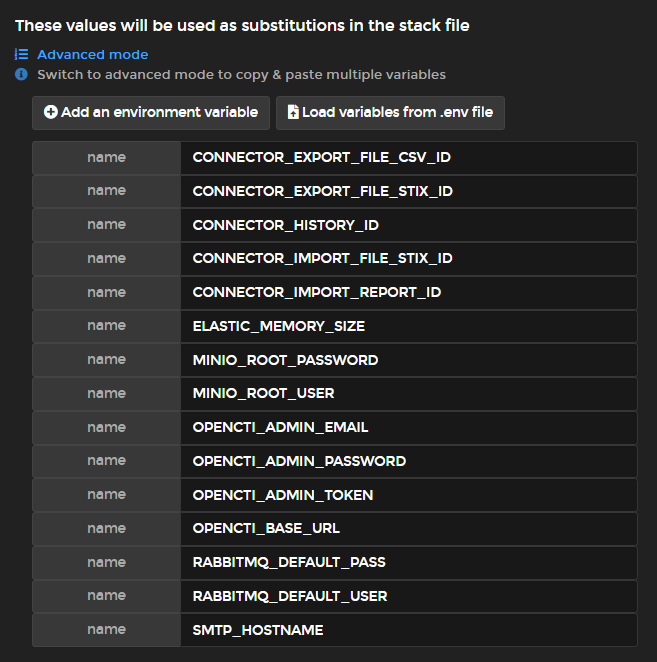
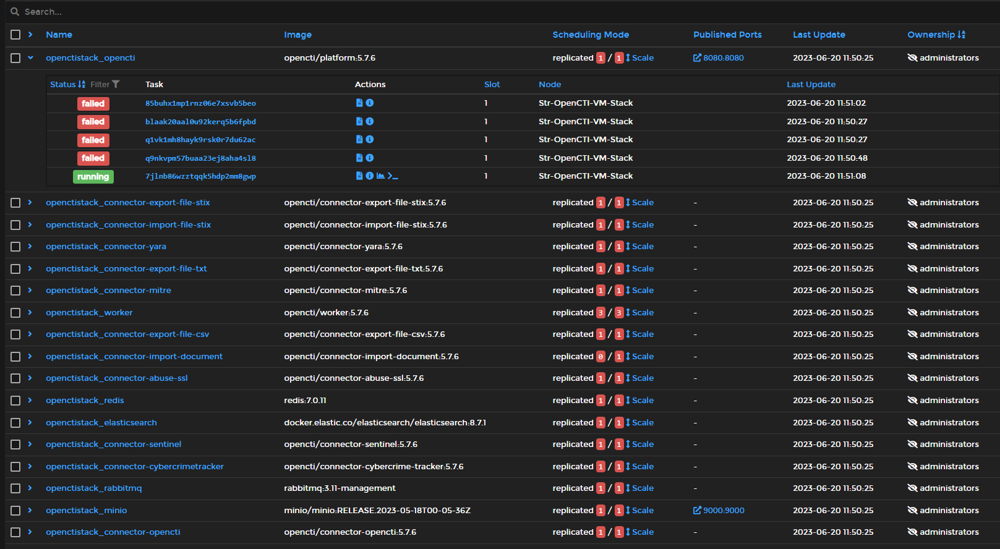
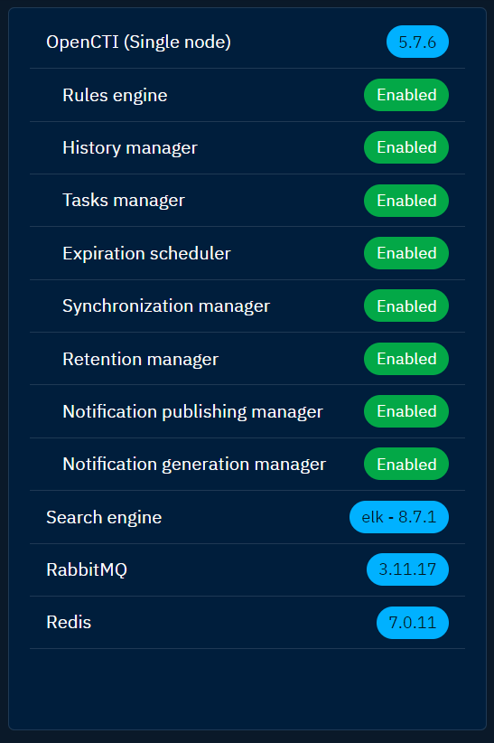
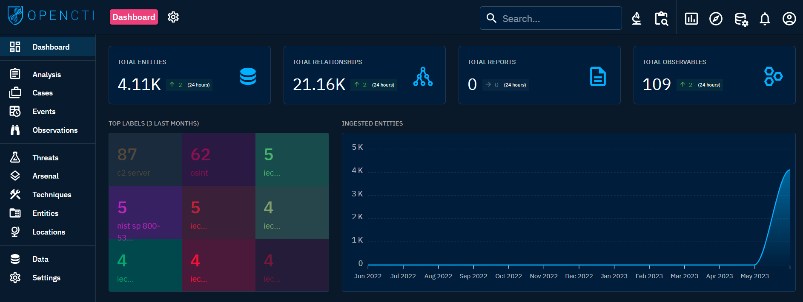
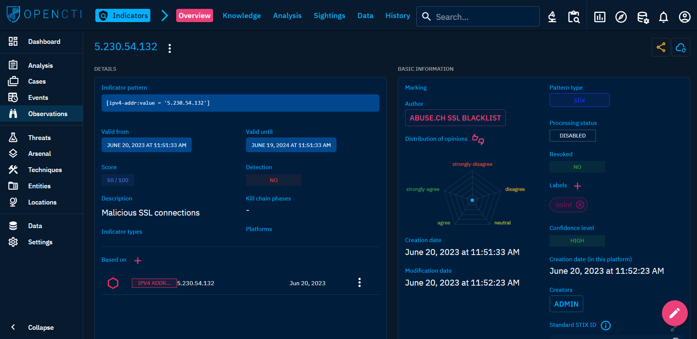
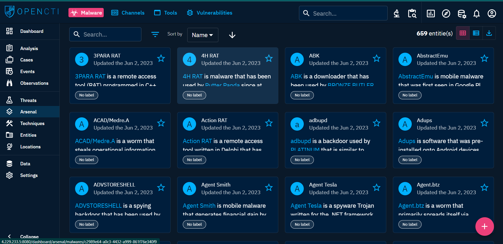
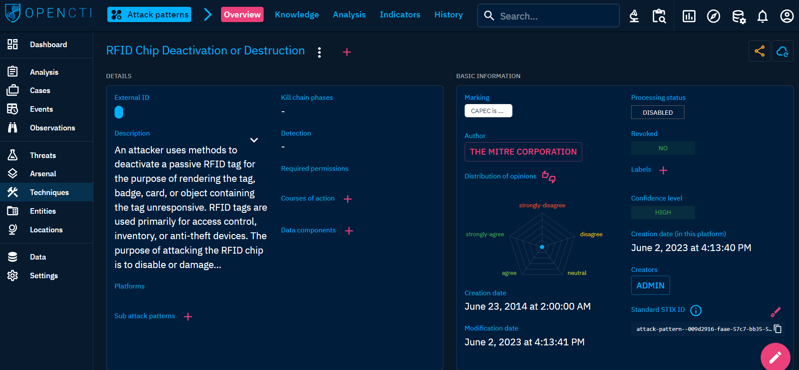

OpenCTI is an advanced and powerful platform that offers a wide range of capabilities for the management, analysis, and sharing of cyber threat intelligence.


This guide will provide step-by-step instructions in implementing and configuring the OpenCTI platform. Additionally, it will walk you through the process of onboarding connectors and effectively obtaining data for the platform.

- [Create Azure Virtual Machine](#azure-virtual-machine)
  - [Network Requirements](#network-requirements)
- [OpenCTI Prerequisites](#opencti-prerequisites)
  - [SSH to the VM](#connect-to-azure-vm-via-ssh)
    - [ElasticSearch Memory](#elasticsearch-requirements)
    - [Install Docker Engine](#install-docker-engine)
    - [Install Portainer](#install-portainer)
- [Deploy OpenCTI Stack](#deploy-opencti-stack)
  - [Production Containers](#opencti-production-containers)
  - [Configure Env Variables](#configure-env-variables)
  - [Sign in to OpenCTI](#sign-in-to-opencti)
  - [Configure Connectors](#configure-connectors)
    - [ Import Document](#connector-import-document)
    - [ MITRE Datasets](#connector-mitre-datasets)
    - [ Cybercrime Tracker](#connector-cybercrime-tracker)
- [Platform Overview](#platform-overview)
    - [Conclude](#conclude)

## Azure Virtual Machine
We will set up the product on a Linux Azure VM using the Ubuntu distribution. 

*Note:* You have the flexibility to use the environment that is more applicable e.g I tried the platform locally before onboarding to Azure.

1. Log in to the Azure Portal.
2. Click on the "Create a resource" button.
3. In the search bar, type "Virtual machine" and select "Virtual machine" from the suggestions.
4. Click on the "Create" button to start the VM creation process.
5. In the "Basics" tab:
   - Choose a subscription.
   - Create a new resource group or select an existing one.
   - Select the region where you want to deploy the VM.
   - Enter a name for your virtual machine.
   - Pick Ubunto for IMG or other distru (effects the docker engine installation later)
   - Select the VM size as D8s_v4 (General purpose).
   - Select SSH Public Key option
   - Allow selected port for  22 or leave it for later config.
6. In the "Disks" tab:
   - Create and attach a new disk
   - Select the OS disk type and size (128 GB).
   - Configure any additional data disks if required.
   - Click on the "Next" button.
7. In the "Networking" tab:
   - Leave the default for now
8. In the "Management" tab:
   - Leave default for now
9. Review the summary and click on the "Create" button to start the VM creation process.

Review The size and The Disk.



Now wait for the VM to be provisioned successfully.


### Network Requirements

Let's configure the required port from now to make sure we can access our app when implemented.

| Rule ID | Rule Name                | Port Range | Protocol | Source          | Destination | Action |
|---------|--------------------------|------------|----------|-----------------|-------------|--------|
| 340     | Portainer Access         | 9900       | TCP      | Source IP Group | Any         | Allow  |
| 360     | OpenCTI Access           | 8080       | TCP      | Source IP Group | Any         | Allow  |
| 101     | allow ICMP               | Any        | ICMP     | Source IP Group | Any         | Allow  |
| 320     | HTTPS                    | 443        | TCP      | Source IP Group | Any         | Allow  |
| 330     | SSH                      | 22         | TCP      | Source IP Group | Any         | Allow  |

Replace "Source IP Group" with the appropriate IP address range or security group that you want to allow access from for each rule, to get started you can simply specify your ip address.




**Note:** It is highly recommended to restrict the source IP addresses to a specific group rather than allowing traffic from "Any" to improve security.


## OpenCTI Prerequisites

We picked Azure Vm as our host for the platform, we will first use Docker Engine to deploy Portainer, a user-friendly container management platform, that will help us with the onboarding of [the containers required](#opencti-production-containers).

### Connect to Azure VM via SSH

1. Open the cloudshell or any CLI authenticated with Azure.
2. Ensure you have read-only access to the private key `chmod 400 <keyname>.pem`
3. Provide a path to your SSH private key file. Replace `<keyname>` with the name of your private key file.
Private key path: `~/.ssh/<keyname>.pem`
4. Run the following command to connect to your VM:
```
ssh -i <private key path> cti-user@vm-ip
```
Replace `<private key path>` with the path to your SSH private key file, and `vm-ip` with the IP address of your Azure VM.

#### ElasticSearch Requirements

First make sure to Increase Virtual Memory for ElasticSearch container.

```sh
sudo sysctl -w vm.max_map_count=1048575
echo 'vm.max_map_count=1048575' | sudo tee --append /etc/sysctl.conf

```

### Install Docker Engine

Docker Engine is a powerful tool that enables us to encapsulate the OpenCTI platform and its dependencies within lightweight and portable containers. 

Follow these step-by-step instructions to install Docker Engine on your VM:

1. **Clean your VM:** Remove any existing Docker-related packages by executing the following command:
```sh
for pkg in docker.io docker-doc docker-compose podman-docker containerd runc; do
  sudo apt-get remove $pkg;
done
```

2. **Set up the repository for OpenCTI:** Update the package lists and install the required tools by running the following commands:
```sh
sudo apt-get update
sudo apt-get install ca-certificates curl gnupg
```

3. **Add Docker's official GPG key:** Obtain and install Docker's GPG key to ensure the authenticity of the downloaded packages. Execute the following commands:

```sh
sudo install -m 0755 -d /etc/apt/keyrings
curl -fsSL https://download.docker.com/linux/ubuntu/gpg | sudo gpg --dearmor -o /etc/apt/keyrings/docker.gpg
sudo chmod a+r /etc/apt/keyrings/docker.gpg

```

- **Set up the Docker repository:** Configure the Docker repository by executing the following command:

```sh
echo "deb [arch=$(dpkg --print-architecture) signed-by=/etc/apt/keyrings/docker.gpg] https://download.docker.com/linux/ubuntu $(. /etc/os-release && echo "$VERSION_CODENAME") stable" | sudo tee /etc/apt/sources.list.d/docker.list > /dev/null
```

- **Install Docker Engine:** Update the package lists and install Docker Engine along with the necessary dependencies using the following commands:

```sh
sudo apt-get update
sudo apt-get install docker-ce docker-ce-cli containerd.io docker-buildx-plugin docker-compose-plugin
```

- Enable the Docker service to start on system boot and grant the current user access to Docker. Run the following commands:
  
```sh
sudo systemctl enable --now docker
sudo usermod -a -G docker $(whoami)
```


### Install Portainer

We will leverage Portainer capabilities to effortlessly deploy our entire OpenCTI platform stack, including all the required services and components.

Follow the instructions below to install and configure Portainer on your VM:


1. Create a directory named `/opt/portainer` and set ownership permissions.
2. Navigate to the Portainer directory: `cd /opt/portainer`.
3. Download the Portainer agent stack file: `curl -sL https://downloads.portainer.io/portainer-agent-stack.yml -o portainer-agent-stack.yml`.
4. **Configuration**:
   - Open the `portainer-agent-stack.yml` file.
   - Modify the port mappings:
     - `"9000:9000"` to `"9900:9000"`
     - `"8000:8000"` to `"8800:8000"`
   - Ensure the specified ports are allowed in the firewall.

**Deploy Portainer**

5. Initialize the Docker swarm: 
```
sudo docker swarm init
```
6. Deploy the Portainer stack: 
```
sudo docker stack deploy --compose-file=portainer-agent-stack.yml portainer
```
7. Access Portainer at `http://<your-ip-address>:9900`.



Make sure to setup your `admin password` and Include other `users` if required.


## Deploy OpenCTI Stack

To deploy the entire OpenCTI stack using Portainer, follow these steps:

1. Access your Portainer interface.
2. Navigate to the **Stacks** section.
3. Click on **Add Stack** to create a new stack.
4. Provide a name for the stack (e.g., `opencti`).
5. In the **Web editor** tab, paste the following configuration into the `docker-compose.yml` file:

```YAML
version: '3'
services:
  redis:
    image: redis:7.0.11
    restart: always
    volumes:
      - redisdata:/data
  elasticsearch:
    image: docker.elastic.co/elasticsearch/elasticsearch:8.8.1
    volumes:
      - esdata:/usr/share/elasticsearch/data
    environment:
      - discovery.type=single-node
      - xpack.ml.enabled=false
      - xpack.security.enabled=false
      - "ES_JAVA_OPTS=-Xms${ELASTIC_MEMORY_SIZE} -Xmx${ELASTIC_MEMORY_SIZE}"
    restart: always
    ulimits:
      memlock:
        soft: -1
        hard: -1
      nofile:
        soft: 65536
        hard: 65536
  minio:
    image: minio/minio:RELEASE.2023-05-18T00-05-36Z
    volumes:
      - s3data:/data
    ports:
      - "9000:9000"
    environment:
      MINIO_ROOT_USER: ${MINIO_ROOT_USER}
      MINIO_ROOT_PASSWORD: ${MINIO_ROOT_PASSWORD}    
    command: server /data
    healthcheck:
      test: ["CMD", "curl", "-f", "http://localhost:9000/minio/health/live"]
      interval: 30s
      timeout: 20s
      retries: 3
    restart: always
  rabbitmq:
    image: rabbitmq:3.12-management
    environment:
      - RABBITMQ_DEFAULT_USER=${RABBITMQ_DEFAULT_USER}
      - RABBITMQ_DEFAULT_PASS=${RABBITMQ_DEFAULT_PASS}
      - RABBITMQ_NODENAME=rabbit01@localhost
    volumes:
      - amqpdata:/var/lib/rabbitmq
    restart: always
  opencti:
    image: opencti/platform:5.8.2
    environment:
      - NODE_OPTIONS=--max-old-space-size=8096
      - APP__PORT=8080
      - APP__BASE_URL=${OPENCTI_BASE_URL}
      - APP__ADMIN__EMAIL=${OPENCTI_ADMIN_EMAIL}
      - APP__ADMIN__PASSWORD=${OPENCTI_ADMIN_PASSWORD}
      - APP__ADMIN__TOKEN=${OPENCTI_ADMIN_TOKEN}
      - APP__APP_LOGS__LOGS_LEVEL=error
      - REDIS__HOSTNAME=redis
      - REDIS__PORT=6379
      - ELASTICSEARCH__URL=http://elasticsearch:9200
      - MINIO__ENDPOINT=minio
      - MINIO__PORT=9000
      - MINIO__USE_SSL=false
      - MINIO__ACCESS_KEY=${MINIO_ROOT_USER}
      - MINIO__SECRET_KEY=${MINIO_ROOT_PASSWORD}
      - RABBITMQ__HOSTNAME=rabbitmq
      - RABBITMQ__PORT=5672
      - RABBITMQ__PORT_MANAGEMENT=15672
      - RABBITMQ__MANAGEMENT_SSL=false
      - RABBITMQ__USERNAME=${RABBITMQ_DEFAULT_USER}
      - RABBITMQ__PASSWORD=${RABBITMQ_DEFAULT_PASS}
      - SMTP__HOSTNAME=${SMTP_HOSTNAME}
      - SMTP__PORT=25
      - PROVIDERS__LOCAL__STRATEGY=LocalStrategy
    ports:
      - "8080:8080"
    depends_on:
      - redis
      - elasticsearch
      - minio
      - rabbitmq
    restart: always
  worker:
    image: opencti/worker:5.8.2
    environment:
      - OPENCTI_URL=http://opencti:8080
      - OPENCTI_TOKEN=${OPENCTI_ADMIN_TOKEN}
      - WORKER_LOG_LEVEL=info
    depends_on:
      - opencti
    deploy:
      mode: replicated
      replicas: 3
    restart: always
  connector-export-file-stix:
    image: opencti/connector-export-file-stix:5.8.2
    environment:
      - OPENCTI_URL=http://opencti:8080
      - OPENCTI_TOKEN=${OPENCTI_ADMIN_TOKEN}
      - CONNECTOR_ID=${CONNECTOR_EXPORT_FILE_STIX_ID} 
      - CONNECTOR_TYPE=INTERNAL_EXPORT_FILE
      - CONNECTOR_NAME=ExportFileStix2
      - CONNECTOR_SCOPE=application/json
      - CONNECTOR_CONFIDENCE_LEVEL=15 
      - CONNECTOR_LOG_LEVEL=info
    restart: always
    depends_on:
      - opencti
  connector-export-file-csv:
    image: opencti/connector-export-file-csv:5.8.2
    environment:
      - OPENCTI_URL=http://opencti:8080
      - OPENCTI_TOKEN=${OPENCTI_ADMIN_TOKEN}
      - CONNECTOR_ID=${CONNECTOR_EXPORT_FILE_CSV_ID} 
      - CONNECTOR_TYPE=INTERNAL_EXPORT_FILE
      - CONNECTOR_NAME=ExportFileCsv
      - CONNECTOR_SCOPE=text/csv
      - CONNECTOR_CONFIDENCE_LEVEL=15 
      - CONNECTOR_LOG_LEVEL=info
    restart: always
    depends_on:
      - opencti
  connector-export-file-txt:
    image: opencti/connector-export-file-txt:5.8.2
    environment:
      - OPENCTI_URL=http://opencti:8080
      - OPENCTI_TOKEN=${OPENCTI_ADMIN_TOKEN}
      - CONNECTOR_ID=${CONNECTOR_EXPORT_FILE_TXT_ID} 
      - CONNECTOR_TYPE=INTERNAL_EXPORT_FILE
      - CONNECTOR_NAME=ExportFileTxt
      - CONNECTOR_SCOPE=text/plain
      - CONNECTOR_CONFIDENCE_LEVEL=15
      - CONNECTOR_LOG_LEVEL=info
    restart: always
    depends_on:
      - opencti
  connector-import-file-stix:
    image: opencti/connector-import-file-stix:5.8.2
    environment:
      - OPENCTI_URL=http://opencti:8080
      - OPENCTI_TOKEN=${OPENCTI_ADMIN_TOKEN}
      - CONNECTOR_ID=${CONNECTOR_IMPORT_FILE_STIX_ID} 
      - CONNECTOR_TYPE=INTERNAL_IMPORT_FILE
      - CONNECTOR_NAME=ImportFileStix
      - CONNECTOR_VALIDATE_BEFORE_IMPORT=true 
      - CONNECTOR_SCOPE=application/json,text/xml
      - CONNECTOR_AUTO=true 
      - CONNECTOR_CONFIDENCE_LEVEL=15 
      - CONNECTOR_LOG_LEVEL=info
    restart: always
    depends_on:
      - opencti
  connector-import-document:
    image: opencti/connector-import-document:5.8.2
    environment:
      - OPENCTI_URL=http://opencti:8080
      - OPENCTI_TOKEN=${OPENCTI_ADMIN_TOKEN}
      - CONNECTOR_ID=${CONNECTOR_IMPORT_DOCUMENT_ID} 
      - CONNECTOR_TYPE=INTERNAL_IMPORT_FILE
      - CONNECTOR_NAME=ImportDocument
      - CONNECTOR_VALIDATE_BEFORE_IMPORT=true 
      - CONNECTOR_SCOPE=application/pdf,text/plain,text/html
      - CONNECTOR_AUTO=true 
      - CONNECTOR_ONLY_CONTEXTUAL=false
      - CONNECTOR_CONFIDENCE_LEVEL=15 
      - CONNECTOR_LOG_LEVEL=info
      - IMPORT_DOCUMENT_CREATE_INDICATOR=true
    restart: always
    depends_on:
      - opencti

volumes:
  esdata:
  s3data:
  redisdata:
  amqpdata:
```

Let's discuss the compose above, the services configured work together to provide the necessary functionality for the OpenCTI platform. 

They handle data storage, messaging, search capabilities, and various import/export operations.

### OpenCTI Production Containers

This is the initial setup of the OpenCTI platform production setup.

| Containers                        | Description                                                                                      |
|-------------------------------:|:----------------------------------------------------------------------------------------------|
| redis                         | Provides a Redis database for caching and queuing.                                        |
| elasticsearch              | Runs an Elasticsearch instance for full-text search and indexing of OpenCTI data. |
| minio                          | Deploys a MinIO server for object storage, used for storing files and attachments.            |
| rabbitmq                    | Sets up a RabbitMQ message broker for asynchronous communication between components.  |
| opencti                        | Spins up the OpenCTI platform itself, hosting the main application logic and user interface. |
| worker                          | Launches multiple instances of the OpenCTI worker, responsible for executing background tasks and processing jobs. |
| connector-export-file-stix            | Handles the export of OpenCTI data in STIX format to an external file.                |
| connector-export-file-csv           | Handles the export of OpenCTI data in CSV format to an external file.                      |
| connector-export-file-txt           | Handles the export of OpenCTI data in plain text format to an external file.                     |
| connector-import-file-stix        | Enables the import of STIX files into the OpenCTI platform.                                |
| connector-import-document | Facilitates the import of various types of documents (PDF, plain text, HTML) into OpenCTI, extracting relevant information and creating indicators. |

The implementation lays the foundation for seamless integration and ingestion of additional value from various sources further. 


### Configure Env Variables

1. Go back to your VM and observe the following environment variables.
```sh
cat << EOF > opencti.env
CONNECTOR_EXPORT_FILE_CSV_ID=$(cat /proc/sys/kernel/random/uuid)
CONNECTOR_EXPORT_FILE_STIX_ID=$(cat /proc/sys/kernel/random/uuid)
CONNECTOR_HISTORY_ID=$(cat /proc/sys/kernel/random/uuid)
CONNECTOR_IMPORT_FILE_STIX_ID=$(cat /proc/sys/kernel/random/uuid)
CONNECTOR_IMPORT_REPORT_ID=$(cat /proc/sys/kernel/random/uuid)
ELASTIC_MEMORY_SIZE=8G
MINIO_ROOT_PASSWORD=$(cat /proc/sys/kernel/random/uuid)
MINIO_ROOT_USER=$(cat /proc/sys/kernel/random/uuid)
OPENCTI_ADMIN_EMAIL=dev@yahya-abulhaj.dev
OPENCTI_ADMIN_PASSWORD=CHANGEMEPLEASE
OPENCTI_ADMIN_TOKEN=$(cat /proc/sys/kernel/random/uuid)
OPENCTI_BASE_URL=http://localhost
RABBITMQ_DEFAULT_PASS=guest
RABBITMQ_DEFAULT_USER=guest
SMTP_HOSTNAME=$(hostname)
EOF
```
2. Generate a unique UUID, you can use `/proc/sys/kernel/random/uuid` from the kernel. Alternatively, you can generate it online using a website like [UUID Generator](https://www.uuidgenerator.net/version4).
3. Set a password for your `OPENCTI_ADMIN_PASSWORD` and change the values of `RABBITMQ_DEFAULT_PASS` and `OPENCTI_BASE_URL` to match your VM and port for OpenCTI.
4. Run the file in Azure VM
5. Take the output of the command and proceed to Portainer.

I have also generated the `opencti.env` file for you. <br>

You can import it into Portainer and verify your variables using the following command:
```
cat opencti.env
```




- Deploy your stack from Portainer 



- Expand on all processes and running containers.


### Sign in to OpenCTI
Once the deployment is complete, your application should be running on `vm-ip:8080`. 


Use the specified password and email in the environment variables to connect.

<details> 
<summary> 
Expand on single node configuration
</summary>
  


</details>

At this point, the platform should looks fresh **without data**.


## Configure Connectors
To do so, Connectors are how you receive and also send data on the OpenCTI platform.

#### **Connector Import Document**

The `connector-import-document` (included) is responsible for importing documents into the OpenCTI platform. It provides the following configuration options:
```YAML
  connector-import-document:
    image: opencti/connector-import-document:5.7.6
    environment:
      - OPENCTI_URL=http://opencti:8080
      - OPENCTI_TOKEN=${OPENCTI_ADMIN_TOKEN}
      - CONNECTOR_ID=${CONNECTOR_IMPORT_DOCUMENT_ID} # Valid UUIDv4
      - CONNECTOR_TYPE=INTERNAL_IMPORT_FILE
      - CONNECTOR_NAME=ImportDocument
      - CONNECTOR_VALIDATE_BEFORE_IMPORT=true # Validate any bundle before import
      - CONNECTOR_SCOPE=application/pdf,text/plain,text/html
      - CONNECTOR_AUTO=true # Enable/disable auto-import of file
      - CONNECTOR_ONLY_CONTEXTUAL=false # Only extract data related to an entity (a report, a threat actor, etc.)
      - CONNECTOR_CONFIDENCE_LEVEL=15 # From 0 (Unknown) to 100 (Fully trusted)
      - CONNECTOR_LOG_LEVEL=info
      - IMPORT_DOCUMENT_CREATE_INDICATOR=true
    restart: always
    depends_on:
      - opencti
```

- `image: opencti/connector-import-document:5.7.6`: Specifies the Docker image to use for the connector.
- `environment`: Sets the environment variables required for the connector.
  - `OPENCTI_URL`: The URL of the OpenCTI instance (e.g., `http://opencti:8080`).
  - `OPENCTI_TOKEN`: The token used for authentication with OpenCTI.
  - `CONNECTOR_ID`: The unique identifier for the connector (UUIDv4 format).
  - `CONNECTOR_TYPE`: The type of connector (`INTERNAL_IMPORT_FILE`).
  - `CONNECTOR_NAME`: The name of the connector (`ImportDocument`).
  - `CONNECTOR_VALIDATE_BEFORE_IMPORT`: Specifies whether to validate the bundle before import (true or false).
  - `CONNECTOR_SCOPE`: The scope of the connector, defining the supported document types.
  - `CONNECTOR_AUTO`: Enables or disables the auto-import of files.
  - `CONNECTOR_ONLY_CONTEXTUAL`: Specifies whether to extract data related to entities only.
  - `CONNECTOR_CONFIDENCE_LEVEL`: The confidence level of the connector (0 to 100).
  - `CONNECTOR_LOG_LEVEL`: The logging level of the connector.
  - `IMPORT_DOCUMENT_CREATE_INDICATOR`: Specifies whether to create indicators during document import.

####  **Connector MITRE Datasets**

The `connector-mitre` section is responsible for importing MITRE datasets into the OpenCTI platform. It provides the following configuration options:
```yaml
  connector-mitre:
    image: opencti/connector-mitre:5.7.6
    environment:
      - OPENCTI_URL=http://opencti:8080
      - OPENCTI_TOKEN=${OPENCTI_ADMIN_TOKEN}
      - CONNECTOR_ID=d65ce4c7-5443-41a9-8712-bfc2153f33c1
      - CONNECTOR_TYPE=EXTERNAL_IMPORT
      - "CONNECTOR_NAME=MITRE Datasets"
      - CONNECTOR_SCOPE=tool,report,malware,identity,campaign,intrusion-set,attack-pattern,course-of-action,x-mitre-data-source,x-mitre-data-component,x-mitre-matrix,x-mitre-tactic,x-mitre-collection
      - CONNECTOR_CONFIDENCE_LEVEL=75
      - CONNECTOR_UPDATE_EXISTING_DATA=false
      - CONNECTOR_RUN_AND_TERMINATE=false
      - CONNECTOR_LOG_LEVEL=info
      - MITRE_INTERVAL=7 # In days
    restart: always
    depends_on:
      - opencti
```
- `image: opencti/connector-mitre:5.7.6`: Specifies the Docker image to use for the connector.
- `environment`: Sets the environment variables required for the connector.
  - `OPENCTI_URL`: The URL of the OpenCTI instance.
  - `OPENCTI_TOKEN`: The token used for authentication with OpenCTI.
  - `CONNECTOR_ID`: The unique identifier for the connector.
  - `CONNECTOR_TYPE`: The type of connector (`EXTERNAL_IMPORT`).
  - `CONNECTOR_NAME`: The name of the connector (`MITRE Datasets`).
  - `CONNECTOR_SCOPE`: The scope of the connector, defining the supported MITRE dataset types.
  - `CONNECTOR_CONFIDENCE_LEVEL`: The confidence level of the connector.
  - `CONNECTOR_UPDATE_EXISTING_DATA`: Specifies whether to update existing data in OpenCTI.
  - `CONNECTOR_RUN_AND_TERMINATE`: Specifies whether the connector should terminate after running.
  - `CONNECTOR_LOG_LEVEL`: The logging level of the connector.
  - `MITRE_INTERVAL`: The interval in days for updating MITRE datasets.

####  **Connector Cybercrime Tracker**

The `connector-cybercrimetracker` section is responsible for importing data from Cybercrime-Tracker into the OpenCTI platform.
```yaml
  connector-cybercrimetracker:
    image: opencti/connector-cybercrime-tracker:5.7.6
    environment:
      - OPENCTI_URL=http://opencti:8080
      - OPENCTI_TOKEN=${OPENCTI_ADMIN_TOKEN}
      - CONNECTOR_ID=672972e6-1b5f-4292-9eb9-f3807b6b423b
      - CONNECTOR_TYPE=EXTERNAL_IMPORT
      - CONNECTOR_NAME=Cybercrime-Tracker
      - CONNECTOR_SCOPE=cybercrime-tracker
      - CONNECTOR_CONFIDENCE_LEVEL=15 # From 0 (Unknown) to 100 (Fully trusted)
      - CONNECTOR_UPDATE_EXISTING_DATA=false
      - CONNECTOR_LOG_LEVEL=info
      - CYBERCRIME_TRACKER_FEED_URL=http://cybercrime-tracker.net/rss.xml
      - CYBERCRIME_TRACKER_TLP=CLEAR
      - CYBERCRIME_TRACKER_INTERVAL=86400
      - CYBERCRIME_TRACKER_CREATE_INDICATORS=true
      - CYBERCRIME_TRACKER_CREATE_OBSERVABLES=true
    restart: always
    depends_on:
      - opencti
```
- `image: opencti/connector-cybercrime-tracker:5.7.6`: Specifies the Docker image to use for the connector.
- `environment`: Sets the environment variables required for the connector.
  - `OPENCTI_URL`: The URL of the OpenCTI instance.
  - `OPENCTI_TOKEN`: The token used for authentication with OpenCTI.
  - `CONNECTOR_ID`: The unique identifier for the connector.
  - `CONNECTOR_TYPE`: The type of connector (`EXTERNAL_IMPORT`).
  - `CONNECTOR_NAME`: The name of the connector (`Cybercrime-Tracker`).
  - `CONNECTOR_SCOPE`: The scope of the connector, defining the supported data types.
  - `CONNECTOR_CONFIDENCE_LEVEL`: The confidence level of the connector.
  - `CONNECTOR_UPDATE_EXISTING_DATA`: Specifies whether to update existing data in OpenCTI.
  - `CONNECTOR_LOG_LEVEL`: The logging level of the connector.
  - `CYBERCRIME_TRACKER_FEED_URL`: The URL of the Cybercrime-Tracker RSS feed.
  - `CYBERCRIME_TRACKER_TLP`: The Traffic Light Protocol (TLP) level for imported data.
  - `CYBERCRIME_TRACKER_INTERVAL`: The interval (in seconds) for fetching new data.
  - `CYBERCRIME_TRACKER_CREATE_INDICATORS`: Specifies whether to create indicators for imported data.
  - `CYBERCRIME_TRACKER_CREATE_OBSERVABLES`: Specifies whether to create observables for imported data.
- `restart: always`: Ensures that the connector container restarts automatically if it crashes or the system reboots.

For the `depends_on: opencti`: Specifies that the connector depends on the availability of the `opencti` service which is the case for all connectors on OpenCTI.


## Platform Overview

After sometimes, the connectors will take effect and you will see data getting to the platform.


Below is the main dashboard.

[White Mode](assets/opencti-with-data.png)



### Product Indicator
This is centralized repository for managing and storing indicators.

OpenCTI supports a wide range of indicator types some of them are listed below.
| Indicator Types    | Description                                   |
|--------------------|-----------------------------------------------|
| IP addresses       | Numerical label assigned to devices in a network|
| Domain names       | Identifiers for websites or network resources  |
| URLs               | Web addresses                                 |
| Hashes             | Cryptographic representations of data          |
| Email addresses    | Unique identifiers for email accounts          |
| File names         | Names of files or executables                  |


Indicator also offers visualizations and analysis tools to explore relationships between indicators, identify patterns, and gain insights into potential threats or attack campaigns.



### Product Arsenal
The Arsenal serves as a repository for various tools and utilities that can be used during the analysis process. Security engineers and operators can find a collection of scripts, software, and other resources that are commonly used in the field of threat intelligence.

Arsenal covers a wide range of tasks incl.
- data enrichment
- Security critical analysis
- Malware investigation




### Product Techniques

Techniques allows security analysts and investigators to document and share their knowledge about specific techniques used by threat actors e.g various tactics, procedures, and tools employed during cyber attacks. 

- Enables knowledge sharing about threat actor techniques.
- Offers detailed descriptions of techniques, including methods and impact.
- Supports cross-referencing with other entities for a comprehensive view.

The information exposed in here can help others security leaders to better understand and respond to potential threats.




#### Conclude

Implementing an OpenCTI platform can significantly enhance your organization's threat intelligence capabilities, enabling proactive defense against cyber threats.

The journey doesn't end there instead it starts. OpenCTI ecosystem offers a wide range of connectors and streams that can be further explored based on your organization's specific requirements. 

Reference
- [OpenCTI Ecosystem](https://www.notion.so/OpenCTI-Ecosystem-868329e9fb734fca89692b2ed6087e76)
- [OpenCTI Documentation](https://docs.opencti.io/5.7.X/)
